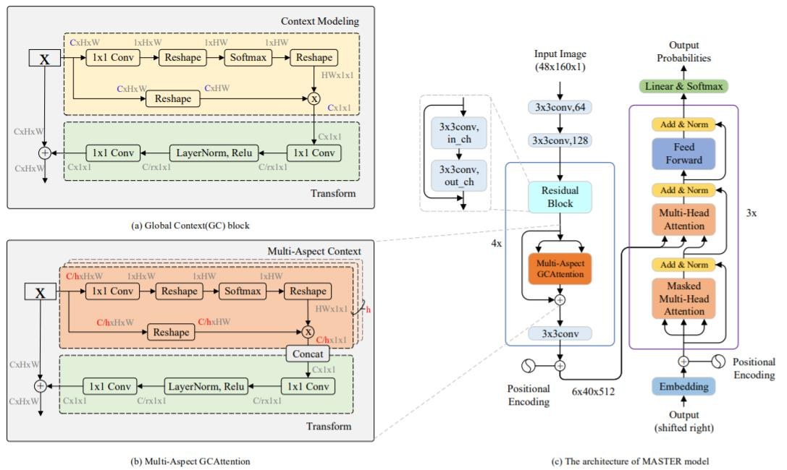

  <h1 align="left">MASTER-mmocr</h1>


<!-- TABLE OF CONTENTS -->

<details open="open">
  <summary><h2 style="display: inline-block">Contents</h2></summary>
  <ol>
    <li>
      <a href="#about-the-project">About The Project</a>
      <ul>
        <li><a href="#Dependency">Dependency</a></li>
      </ul>
    </li>
    <li>
      <a href="#getting-started">Getting Started</a>
      <ul>
        <li><a href="#prerequisites">Prerequisites</a></li>
        <li><a href="#installation">Installation</a></li>
      </ul>
    </li>
    <li><a href="#usage">Usage</a></li>
    <li><a href="#result">Result</a></li>
    <li><a href="#coming-soon">Coming Soon</a></li>
    <li><a href="#license">License</a></li>  
    <li><a href="#Citations">Citations</a></li>
    <li><a href="#acknowledgements">Acknowledgements</a></li>
  </ol>
</details>


<!-- ABOUT THE PROJECT -->

## About The Project

This project is a re-implementation of [MASTER: Multi-Aspect Non-local Network for Scene Text Recognition](https://arxiv.org/abs/1910.02562) by [MMOCR](https://github.com/open-mmlab/mmocr)，which is an open-source toolbox based on PyTorch. The overall architecture will be shown below.




### Dependency

* [MMOCR-0.2.0](https://github.com/open-mmlab/mmocr/tree/v0.2.0)
* [MMDetection-2.11.0](https://github.com/open-mmlab/mmdetection/tree/v2.11.0)
* [mmcv-full-1.3.4](https://github.com/open-mmlab/mmcv/tree/v1.3.4)


<!-- GETTING STARTED -->

## Getting Started

### Prerequisites

+ Use Synthetic image datasets: [SynthText (Synth800k)](https://www.robots.ox.ac.uk/~vgg/data/scenetext/), [MJSynth (Synth90k)](https://www.robots.ox.ac.uk/~vgg/data/text/) for training.
+ Real image datasets: [IIIT5K](http://cvit.iiit.ac.in/projects/SceneTextUnderstanding/IIIT5K.html), [SVT](http://www.iapr-tc11.org/dataset/SVT/svt.zip), [IC03](http://iapr-tc11.org/mediawiki/index.php?title=ICDAR_2003_Robust_Reading_Competitions), [IC13](http://rrc.cvc.uab.es/?ch=2), [IC15](https://rrc.cvc.uab.es/?ch=4), [SVTP](https://github.com/Jyouhou/SceneTextPapers/raw/master/datasets/svt-p.zip), [CUTE80](https://github.com/ocr-algorithm-and-data/CUTE80) for testing.

* Dataset [download link](https://drive.google.com/file/d/1guS_MKlTrfGDQhqXFKglLFUrzs9F4MTL/view).
* Change dataset path in MASTER config.

### Installation

1. Install mmdetection. click [here](https://github.com/open-mmlab/mmdetection/blob/v2.11.0/docs/get_started.md) for details.
   
   ```sh
   # We embed mmdetection-2.11.0 source code into this project.
   # You can cd and install it (recommend).
   cd ./mmdetection-2.11.0
   pip install -v -e .
   ```
   
2. Install mmocr. click [here](https://github.com/open-mmlab/mmocr/blob/main/docs/install.md) for details.

   ```sh
   # install mmocr
   cd ./MASTER_mmocr
   pip install -v -e .
   ```

3. Install mmcv-full-1.3.4. click [here](https://github.com/open-mmlab/mmcv) for details.

   ```sh
   pip install mmcv-full=={mmcv_version} -f https://download.openmmlab.com/mmcv/dist/{cu_version}/{torch_version}/index.html
   
   # install mmcv-full-1.3.4 with torch version 1.8.0 cuda_version 10.2
   pip install mmcv-full==1.3.4 -f https://download.openmmlab.com/mmcv/dist/cu102/torch1.8.0/index.html
   ```


<!-- USAGE EXAMPLES -->

## Usage

The usage of this project, is consistent with [MMOCR-0.2.0](https://github.com/open-mmlab/mmocr/tree/v0.2.0). You can click [here](https://github.com/open-mmlab/mmocr/blob/main/docs/getting_started.md) for mmocr usage details.


For training, run command

```shell
CUDA_VISIBLE_DEVICES={device_id} PORT={port_number} ./tools/dist_train.sh {config_path} {work_dir} {gpu_number}

# example
CUDA_VISIBLE_DEVICES=0 PORT=29500 ./tools/dist_train.sh ./configs/textrecog/master/master_ResnetExtra_academic_dataset_dynamic_mmfp16.py /expr/mmocr_text_line_recognition/ 1
```


PS : 

+ As mentioned in **Prerequisites** part, we use synthetic image datasets for training and real image datasets for evalutating. The 7 real image datasets mentioned above will be evaluated at each evaluation interval. 


<!-- Result -->

## Result

| Dataset | Paper reported accuracy | Our accuracy |
| :-----: | :---------------------: | :----------: |
| IIIT5K  |          95.0           |    95.07     |
|   SVT   |          90.6           |    90.42     |
|  IC03   |          96.4           |    95.58     |
|  IC13   |          95.3           |    96.03     |
|  IC15   |          79.4           |    80.95     |
|  SVTP   |          84.5           |    84.34     |
| CUTE80  |          87.5           |    90.62     |


<!-- COMING SOON -->

## Coming Soon

+ 1st Solution for ICDAR 2021 Competition on Scientific Table Image Recognition to Latex.


<!-- LICENSE -->

## License

This project is licensed under the MIT License. See LICENSE for more details.


<!-- Citations -->

## Citations

If you find MASTER useful please cite [paper](https://arxiv.org/abs/1910.02562):

```latex
@article{Lu2021MASTER,
  title={{MASTER}: Multi-Aspect Non-local Network for Scene Text Recognition},
  author={Ning Lu and Wenwen Yu and Xianbiao Qi and Yihao Chen and Ping Gong and Rong Xiao and Xiang Bai},
  journal={Pattern Recognition},
  year={2021}
}
```


<!-- ACKNOWLEDGEMENTS -->

## Acknowledgements

* [MASTER-pytorch](https://github.com/wenwenyu/MASTER-pytorch)
* [MASTER-TF](https://github.com/jiangxiluning/MASTER-TF)
* [OpenMMLab](https://github.com/open-mmlab)
* [TableMASTER-mmocr](https://github.com/JiaquanYe/TableMASTER-mmocr)
